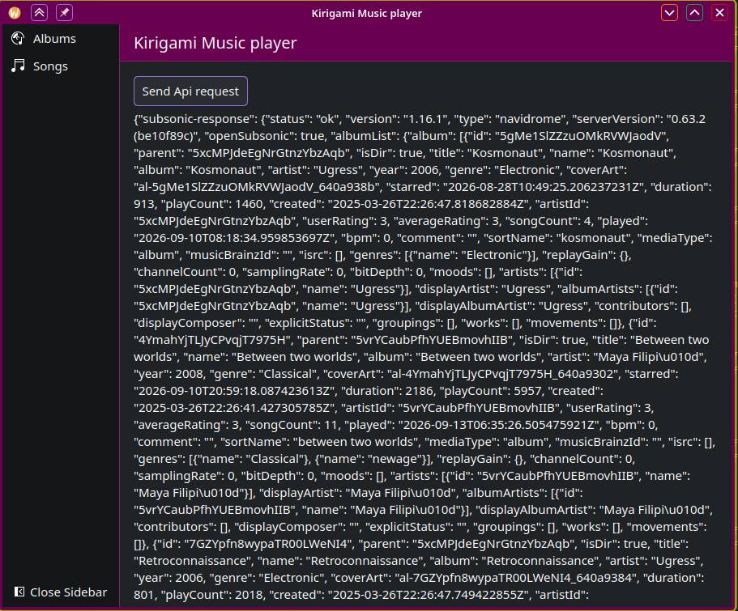

# Kirigami-Music

A opensonic/naivdrome music client for the kde plasma desktop.

It aims to allows users to

- Access their music library
- Play music from their library
- Download music from their library onto their pc, where the system shall only
  play the song locally unless it's deleted.

Current progress as of 13/09/2026

